# People_errand_app

### 登入畫面
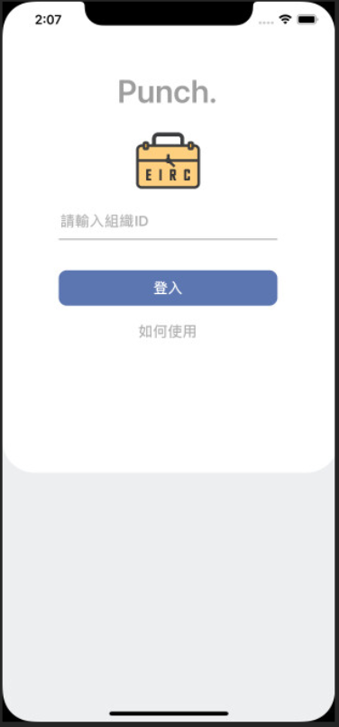
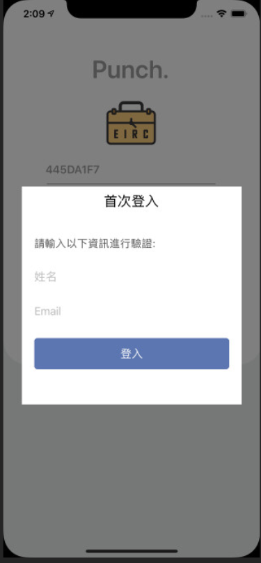，

* 使用者首次登入時輸入姓名、Email提供後台管理員審核，管理員審核通過時即可登入至主畫面，往後使用者進入APP時會自動登入。

### 主頁
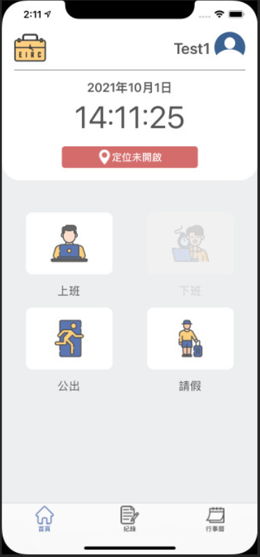

* 主頁顯示目前日期、時間
* 若GPS定位未開啟時則在主頁進行顯示，若GPS開啟時使用者點擊按鈕可查看目前定位地圖
* 主頁右上方顯示使用者姓名，點擊圖像則進入個人資料頁面
* 主頁可進行上下班打卡，若使用者進入公司設定打卡範圍內且為上班時間，即可進行上班打卡；若使用者進入公司設定打卡範圍內且為下班時間，即可進行下班打卡
* 主頁可進行公出，使用者公出時可點擊公出按紐則進入公出頁面
* 主頁可進行請假，使用者有請假需求時點擊請假按鈕則進入請假頁面

### 主頁(管理者)
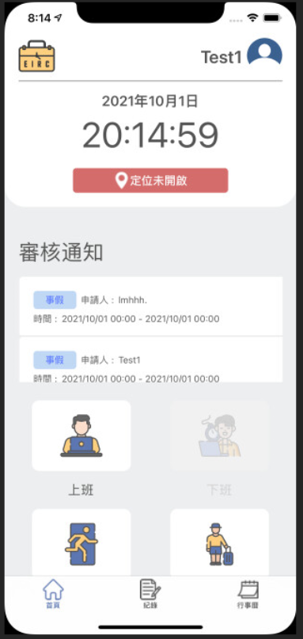
* 管理者擁有上述功能，另在主頁顯示審核通知，當員工有請假申請時管理員主頁則出現審核通知，點擊通知可進入重要審核頁面進行請假審核

### 重要審核頁面(管理者)
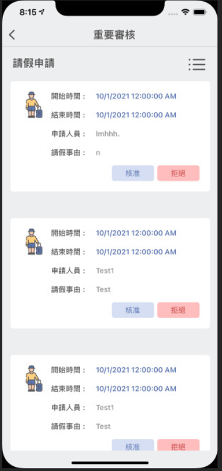
* 管理者可於重要審核頁面進行請假審核，點擊核准按紐，即核准員工請假申請並寄Email通知員工；點擊拒絕按紐，即拒絕員工請假申請並寄Email通知員工

### 個人資料頁面
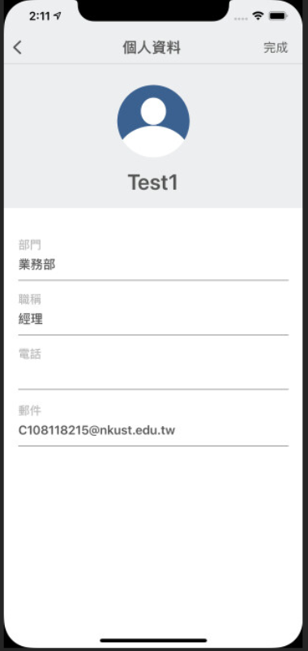
* 使用者可於個人資料頁面修改手機號碼、Email

### 公出頁面
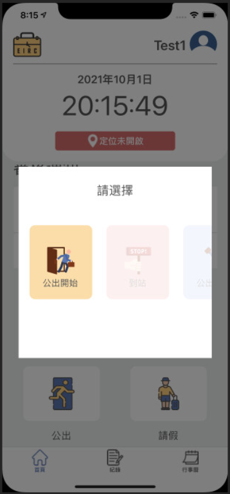
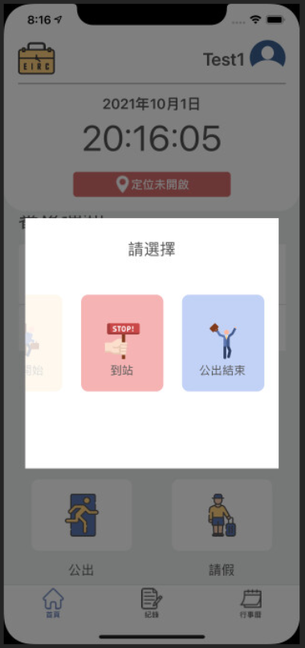
* 使用者可於公出頁面進行公出，並記錄下使用者的公出開始、到站、公出結束的時間與地點

### 請假頁面
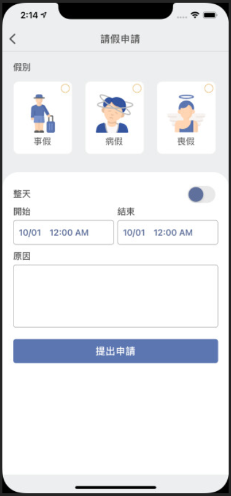
* 使用者可於請假頁面提出請假申請，選擇請假假別、請假開始與結束的日期和時間(也可只選擇日期)，輸入請假事由，即可提出申請

### 紀錄頁面
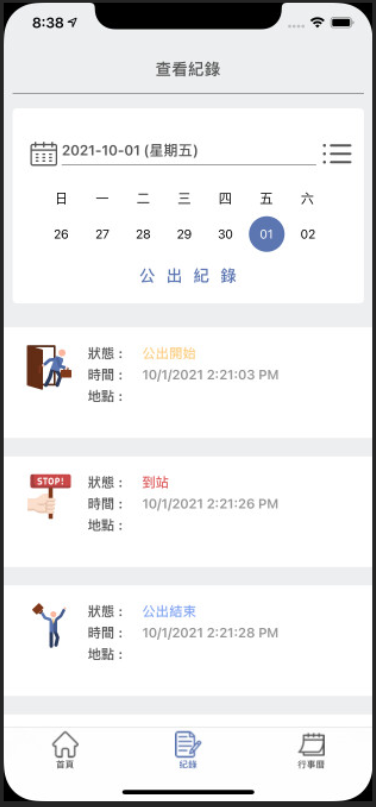
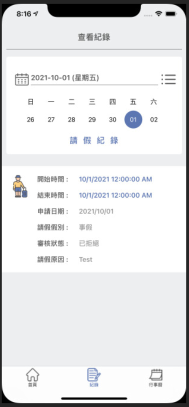
* 使用者可於紀錄頁面查看自己的上下班打卡、公出、請假紀錄，使用者可篩選日期查看所選擇之日期，也可篩選紀錄查看所選擇之紀錄類型

